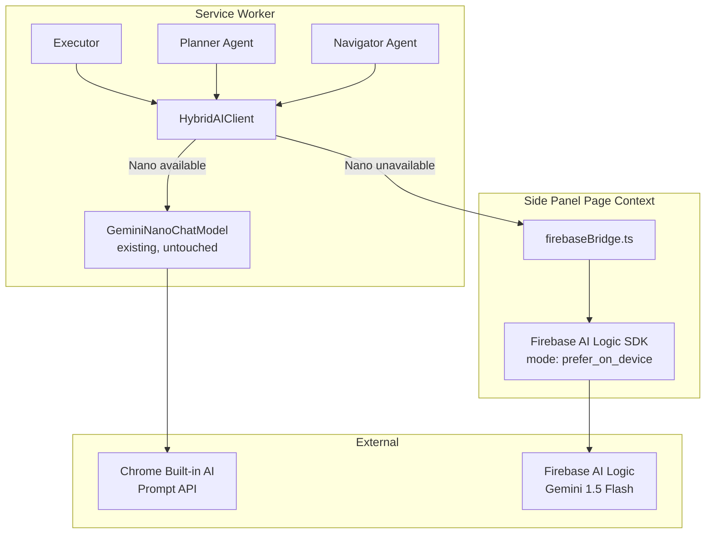

# Design Document

## Overview

This design implements a Gemini Nano-first architecture with Firebase AI Logic SDK fallback. The service worker keeps the existing working GeminiNanoChatModel for on-device inference. When Nano is unavailable, the service worker messages the side panel, which runs Firebase AI Logic Web SDK with `mode: InferenceMode.PREFER_ON_DEVICE` to handle cloud fallback. All non-Google LLM providers are removed.

## Architecture

### High-Level Architecture



### Component Structure

```
chrome-extension/
├── src/background/
│   ├── llm/
│   │   ├── HybridAIClient.ts (new)
│   │   ├── constants.ts (new - message types)
│   │   └── langchain/
│   │       └── GeminiNanoChatModel.ts (existing, keep)
│   ├── agent/
│   │   ├── executor.ts (modify)
│   │   ├── agents/
│   │   │   ├── base.ts (modify)
│   │   │   ├── planner.ts (modify)
│   │   │   └── navigator.ts (modify)
│   │   └── helper.ts (remove)
│   └── index.ts (modify)
└── pages/side-panel/src/
    └── firebaseBridge.ts (new)
```

## Components and Interfaces

### 1. HybridAIClient (Service Worker)

Central client that routes to Nano or side panel bridge.

```typescript
// chrome-extension/src/background/llm/HybridAIClient.ts

interface InvokeOptions {
  prompt: string;
  system?: string;
  schema?: any; // Zod schema or JSON schema
  stream?: boolean;
}

interface InvokeResponse {
  content: string;
  provider: 'nano' | 'cloud';
}

interface AIStatus {
  provider: 'nano' | 'cloud' | 'unknown';
  nano: {
    availability: 'available' | 'readily' | 'downloading' | 'unavailable';
  };
  lastError?: string;
}

class HybridAIClient {
  private availability: string = 'unavailable';
  private nanoModel: GeminiNanoChatModel | null = null;

  async initialize(): Promise<void> {
    // Check Nano availability
    if (globalThis.LanguageModel) {
      this.availability = await globalThis.LanguageModel.availability();
      
      if (this.availability === 'available' || this.availability === 'readily') {
        this.nanoModel = new GeminiNanoChatModel();
      }
    }
  }

  async invoke(options: InvokeOptions): Promise<InvokeResponse> {
    // Try Nano first if available
    if (this.nanoModel && (this.availability === 'available' || this.availability === 'readily')) {
      try {
        const result = await this.invokeNano(options);
        return { content: result, provider: 'nano' };
      } catch (error) {
        console.warn('[HybridAIClient] Nano failed, falling back to cloud:', error);
      }
    }

    // Fallback to side panel bridge
    return await this.invokeBridge(options);
  }

  private async invokeNano(options: InvokeOptions): Promise<string> {
    // Use existing GeminiNanoChatModel
    // Convert string prompt to LangChain messages
    const messages: BaseMessage[] = [];
    if (options.system) {
      messages.push(new SystemMessage(options.system));
    }
    messages.push(new HumanMessage(options.prompt));

    if (options.schema) {
      // Use withStructuredOutput for schema-based invocation
      const structured = this.nanoModel!.withStructuredOutput(options.schema);
      const result = await structured.invoke(messages);
      return JSON.stringify(result);
    } else {
      // Regular invocation
      const result = await this.nanoModel!.invoke(messages);
      return result.content as string;
    }
  }

  private async invokeBridge(options: InvokeOptions): Promise<InvokeResponse> {
    const response = await chrome.runtime.sendMessage({
      type: 'HYBRID_SDK_INVOKE',
      payload: {
        prompt: options.prompt,
        system: options.system,
        schema: options.schema,
        stream: options.stream,
      },
    });

    if (!response?.ok) {
      throw new Error(response?.error || 'SDK fallback failed');
    }

    return {
      content: response.text,
      provider: 'cloud',
    };
  }

  getStatus(): AIStatus {
    return {
      provider: this.nanoModel ? 'nano' : 'cloud',
      nano: {
        availability: this.availability as any,
      },
    };
  }
}
```

### 2. Firebase Bridge (Side Panel)

Runs Firebase AI Logic SDK in page context.

```typescript
// pages/side-panel/src/firebaseBridge.ts

import { initializeApp } from 'firebase/app';
import { getAI, getGenerativeModel, GoogleAIBackend, InferenceMode, Schema } from 'firebase/ai';

// Message type constant
const HYBRID_SDK_INVOKE = 'HYBRID_SDK_INVOKE';

// Initialize Firebase (config from storage or env)
const firebaseConfig = {
  // Load from extension storage or environment
  apiKey: 'YOUR_API_KEY',
  projectId: 'YOUR_PROJECT_ID',
  // ... other config
};

const app = initializeApp(firebaseConfig);
const ai = getAI(app, { backend: new GoogleAIBackend() });

// Create hybrid model: prefer on-device, fallback to cloud
// Note: model name must be inside inCloudParams
const model = getGenerativeModel(ai, {
  mode: InferenceMode.PREFER_ON_DEVICE,
  inCloudParams: {
    model: 'gemini-1.5-flash',
  },
});

// Listen for fallback requests from service worker
chrome.runtime.onMessage.addListener((msg, _sender, sendResponse) => {
  if (msg?.type !== HYBRID_SDK_INVOKE) return;

  (async () => {
    try {
      const { prompt, system, schema, stream } = msg.payload;

      // Build parts
      const parts = [];
      if (system) parts.push({ text: system });
      parts.push({ text: prompt });

      // Handle structured output if schema provided
      let modelToUse = model;
      if (schema) {
        // Convert schema to Firebase Schema format
        const firebaseSchema = convertToFirebaseSchema(schema);
        
        // Create model with structured output config
        modelToUse = getGenerativeModel(ai, {
          mode: InferenceMode.PREFER_ON_DEVICE,
          inCloudParams: {
            model: 'gemini-1.5-flash',
            generationConfig: {
              responseMimeType: 'application/json',
              responseSchema: firebaseSchema,
            },
          },
          onDeviceParams: {
            promptOptions: {
              responseConstraint: firebaseSchema,
            },
          },
        });
      }

      // Generate content
      if (stream) {
        const streamResp = await modelToUse.generateContentStream(parts);
        const text = await collectStream(streamResp);
        sendResponse({ ok: true, provider: 'cloud', text });
      } else {
        const resp = await modelToUse.generateContent(parts);
        const text = resp.response.text();
        sendResponse({ ok: true, provider: 'cloud', text });
      }
    } catch (error) {
      sendResponse({ ok: false, error: String(error) });
    }
  })();

  return true; // async response
});

// Helper to convert JSON schema to Firebase Schema format
function convertToFirebaseSchema(jsonSchema: any): any {
  // Convert JSON schema to Firebase Schema.object() format
  // This is a simplified example - full implementation would handle all schema types
  if (jsonSchema.type === 'object' && jsonSchema.properties) {
    const props: Record<string, any> = {};
    for (const [key, value] of Object.entries(jsonSchema.properties)) {
      const propSchema = value as any;
      if (propSchema.type === 'string') {
        props[key] = Schema.string();
      } else if (propSchema.type === 'number') {
        props[key] = Schema.number();
      } else if (propSchema.type === 'boolean') {
        props[key] = Schema.boolean();
      } else if (propSchema.type === 'array') {
        props[key] = Schema.array(convertToFirebaseSchema(propSchema.items));
      } else if (propSchema.type === 'object') {
        props[key] = convertToFirebaseSchema(propSchema);
      }
    }
    return Schema.object(props);
  }
  return jsonSchema;
}

async function collectStream(streamResp: any): Promise<string> {
  let output = '';
  for await (const chunk of streamResp.stream) {
    output += chunk.text();
  }
  return output;
}
```

### 3. Modified BaseAgent

Update to use HybridAIClient instead of BaseChatModel.

```typescript
// chrome-extension/src/background/agent/agents/base.ts

export interface BaseAgentOptions {
  aiClient: HybridAIClient; // Changed from chatLLM: BaseChatModel
  context: AgentContext;
  prompt: BasePrompt;
}

export abstract class BaseAgent<T extends z.ZodType, M = unknown> {
  protected aiClient: HybridAIClient; // Changed
  protected modelOutputSchema: T;
  // ... other fields

  constructor(modelOutputSchema: T, options: BaseAgentOptions) {
    this.aiClient = options.aiClient;
    this.modelOutputSchema = modelOutputSchema;
    // ... rest
  }

  async invoke(inputMessages: BaseMessage[]): Promise<this['ModelOutput']> {
    // Convert LangChain messages to prompt
    const prompt = this.convertMessagesToPrompt(inputMessages);
    const systemPrompt = this.prompt.getSystemMessage().content as string;

    // Call HybridAIClient
    const response = await this.aiClient.invoke({
      prompt,
      system: systemPrompt,
      schema: this.modelOutputSchema,
    });

    // Parse response
    try {
      return this.modelOutputSchema.parse(JSON.parse(response.content));
    } catch {
      // Fallback parsing
      return this.parseResponse(response.content);
    }
  }

  private convertMessagesToPrompt(messages: BaseMessage[]): string {
    return messages
      .map(msg => {
        const type = msg._getType();
        if (type === 'human') return `User: ${msg.content}`;
        if (type === 'ai') return `Assistant: ${msg.content}`;
        return String(msg.content);
      })
      .join('\n\n');
  }

  abstract execute(): Promise<AgentOutput<M>>;
}
```

### 4. Modified Executor

Pass HybridAIClient to agents.

```typescript
// chrome-extension/src/background/agent/executor.ts

export class Executor {
  private readonly aiClient: HybridAIClient;
  private readonly navigator: NavigatorAgent;
  private readonly planner: PlannerAgent;

  constructor(
    task: string,
    taskId: string,
    browserContext: BrowserContext,
    aiClient: HybridAIClient, // Changed
    extraArgs?: Partial<ExecutorExtraArgs>,
  ) {
    this.aiClient = aiClient;

    // Create context
    const context = new AgentContext(/* ... */);

    // Create agents with HybridAIClient
    this.navigator = new NavigatorAgent(navigatorActionRegistry, {
      aiClient: this.aiClient,
      context,
      prompt: navigatorPrompt,
    });

    this.planner = new PlannerAgent({
      aiClient: this.aiClient,
      context,
      prompt: plannerPrompt,
    });
  }

  // ... rest of executor
}
```

## Data Models

### Message Contract

```typescript
// chrome-extension/src/background/llm/constants.ts

export const HYBRID_SDK_INVOKE = 'HYBRID_SDK_INVOKE';

export interface HybridSDKInvokeMessage {
  type: typeof HYBRID_SDK_INVOKE;
  payload: {
    prompt: string;
    system?: string;
    schema?: any;
    stream?: boolean;
  };
}

export interface HybridSDKResponse {
  ok: boolean;
  provider?: 'cloud';
  text?: string;
  error?: string;
}
```

### Status Model

```typescript
interface AIStatus {
  provider: 'nano' | 'cloud' | 'unknown';
  nano: {
    availability: 'available' | 'readily' | 'downloading' | 'unavailable';
  };
  lastError?: string;
}
```

## Error Handling

### Error Strategy

```typescript
class HybridAIClient {
  async invoke(options: InvokeOptions): Promise<InvokeResponse> {
    // 1. Try Nano if available
    if (this.nanoModel) {
      try {
        return await this.invokeNano(options);
      } catch (error) {
        console.warn('[HybridAIClient] Nano failed:', error);
        // Continue to fallback
      }
    }

    // 2. Fallback to bridge
    try {
      return await this.invokeBridge(options);
    } catch (error) {
      console.error('[HybridAIClient] Bridge failed:', error);
      throw new Error('All inference methods failed');
    }
  }
}
```

## Testing Strategy

### Unit Tests

1. **HybridAIClient Tests**
   - Mock `globalThis.LanguageModel.availability()` to return 'available'
   - Assert Nano path is used
   - Mock to return 'unavailable'
   - Assert bridge path is used

2. **Bridge Tests**
   - Mock Firebase SDK
   - Test message handling
   - Test error responses

### Integration Tests

1. **Agent Tests**
   - Test Planner with HybridAIClient
   - Test Navigator with HybridAIClient
   - Verify functional equivalence

2. **E2E Tests**
   - Test with Nano enabled
   - Test with Nano disabled
   - Verify status chip updates

## Manifest Configuration

```javascript
// manifest.js

{
  manifest_version: 3,
  name: 'Shannon', // Rebranded
  permissions: [
    'storage',
    'activeTab',
    'scripting',
    'sidePanel',
    'alarms',
  ],
  host_permissions: [
    '<all_urls>', // For Firebase domains
  ],
  content_security_policy: {
    extension_pages: "script-src 'self'; object-src 'self'; connect-src 'self' https://firebasevertexai.googleapis.com https://firebasestorage.googleapis.com https://www.googleapis.com https://generativelanguage.googleapis.com"
  },
  background: {
    service_worker: 'background.js',
    type: 'module',
  },
  side_panel: {
    default_path: 'side-panel.html',
  },
}
```

## Shannon Branding

### Visual Identity

**Logo Concept:**
- Inspired by Maxwell's demon (thought experiment in thermodynamics/information theory)
- Stylized demon figure sorting information
- Color scheme: Deep blues and purples
- Modern, friendly, not scary
- Subtle binary/entropy symbols

**Assets:**
- 128x128px: `chrome-extension/public/icon-128.png`
- 32x32px: `chrome-extension/public/icon-32.png`
- SVG source for scalability

### Text Updates

Files to update:
- `manifest.js` - name: "Shannon"
- `package.json` - name, description
- `README.md` and localized versions
- All UI components
- Locale files in `chrome-extension/public/_locales/*/messages.json`

## Implementation Phases

### Phase 1: Core Infrastructure
- Create `HybridAIClient.ts`
- Create `constants.ts` for message types
- Create `firebaseBridge.ts` in side panel
- Add Firebase dependencies

### Phase 2: Agent Integration
- Modify `BaseAgent` to use `HybridAIClient`
- Update `Executor` to create and pass `HybridAIClient`
- Update `Planner` and `Navigator`

### Phase 3: Cleanup
- Remove `helper.ts`
- Remove non-Google provider imports
- Clean `package.json` dependencies
- Remove provider UI components

### Phase 4: UI & Status
- Add status chip to side panel
- Wire status updates from `HybridAIClient.getStatus()`

### Phase 5: Branding
- Design Shannon logo
- Update all text references
- Update manifest and docs

### Phase 6: Testing
- Unit tests for HybridAIClient
- Integration tests for agents
- E2E tests for both paths

## Security Considerations

1. **Firebase Config**: Store API keys in extension storage, not hardcoded
2. **CSP**: Restrict connect-src to only Firebase domains
3. **Permissions**: Minimal necessary permissions
4. **Data Privacy**: Prefer on-device (Nano) for sensitive data

## Performance Considerations

1. **Latency**:
   - Nano: ~100-500ms (on-device)
   - Cloud: ~1-3s (network + inference)

2. **Session Management**:
   - Reuse Nano sessions (already implemented in GeminiNanoChatModel)
   - Clean up on extension unload

3. **Message Passing**:
   - Async message handling
   - Timeout handling for bridge calls

## Migration Path

1. Keep existing code working during development
2. Test HybridAIClient in parallel
3. Gradual rollout to agents
4. Remove old providers after verification
5. Monitor error rates and fallback frequency

## Success Metrics

1. **Functional**: All tests pass, no regressions
2. **Performance**: Nano usage rate when available
3. **Code Quality**: Reduced dependencies, smaller bundle
4. **User Experience**: Transparent provider usage, fast responses
