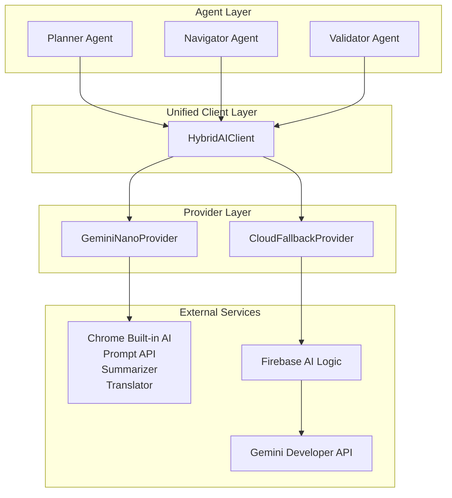

# Design Document

## Overview

This design outlines the migration of the Nanobrowser Chrome extension to Shannon, replacing the current multi-provider LLM architecture with a Gemini Nano-first approach. The system will use Chrome's built-in AI capabilities (Prompt API, Summarizer, Translator) as the primary inference engine, with a single cloud fallback to Firebase AI Logic → Gemini Developer API.

The migration maintains the existing multi-agent architecture (Planner, Navigator, Validator) while centralizing all LLM interactions behind a unified `HybridAIClient` interface. This approach ensures consistent behavior across agents while enabling seamless fallback when on-device AI is unavailable.

Additionally, the extension will be rebranded from Nanobrowser to Shannon, with new visual identity inspired by Maxwell's demon and information theory.

## Architecture

### High-Level Architecture



### Component Hierarchy

```
chrome-extension/src/
├── background/
│   ├── agent/
│   │   ├── agents/
│   │   │   ├── base.ts (modified)
│   │   │   ├── planner.ts (modified)
│   │   │   ├── navigator.ts (modified)
│   │   │   └── validator.ts (if exists, modified)
│   │   ├── executor.ts (modified)
│   │   └── helper.ts (deprecated/removed)
│   └── llm/
│       ├── client/
│       │   ├── HybridAIClient.ts (new)
│       │   └── types.ts (new)
│       ├── providers/
│       │   ├── GeminiNanoProvider.ts (new)
│       │   ├── CloudFallbackProvider.ts (new)
│       │   └── types.ts (new)
│       └── utils/
│           ├── detection.ts (new)
│           └── errors.ts (new)
```

## Components and Interfaces

### 1. HybridAIClient

The central client that manages all LLM interactions and implements the fallback strategy.

```typescript
interface InvokeOptions {
  prompt: string;
  schema?: z.ZodType;
  systemPrompt?: string;
  temperature?: number;
  maxTokens?: number;
  signal?: AbortSignal;
}

interface InvokeResponse<T = unknown> {
  content: string;
  parsed?: T;
  provider: 'nano' | 'cloud';
  metadata: {
    model: string;
    tokensUsed?: number;
    latency: number;
  };
}

class HybridAIClient {
  private nanoProvider: GeminiNanoProvider | null;
  private cloudProvider: CloudFallbackProvider;
  private forceCloudFallback: boolean;
  private status: AIStatus;

  constructor(config: HybridAIClientConfig);
  
  async invoke<T = unknown>(options: InvokeOptions): Promise<InvokeResponse<T>>;
  async invokeStream(options: InvokeOptions): AsyncGenerator<string>;
  
  getStatus(): AIStatus;
  setForceCloudFallback(force: boolean): void;
  
  private async tryNano<T>(options: InvokeOptions): Promise<InvokeResponse<T> | null>;
  private async fallbackToCloud<T>(options: InvokeOptions, reason: string): Promise<InvokeResponse<T>>;
}

interface AIStatus {
  nanoAvailable: boolean;
  nanoReady: boolean;
  currentProvider: 'nano' | 'cloud' | 'unknown';
  lastError?: string;
}
```

**Key Responsibilities:**
- Detect Gemini Nano availability on initialization
- Route requests to Nano provider when available
- Automatically fallback to cloud on failure or unavailability
- Track and report current AI status
- Support both structured and unstructured output
- Maintain streaming capabilities

### 2. GeminiNanoProvider

Implements Chrome's built-in AI capabilities.

```typescript
interface NanoCapabilities {
  promptAPI: boolean;
  summarizer: boolean;
  translator: boolean;
}

class GeminiNanoProvider {
  private capabilities: NanoCapabilities;
  private session: AILanguageModel | null;

  constructor();
  
  async initialize(): Promise<boolean>;
  async checkAvailability(): Promise<NanoCapabilities>;
  
  async generateText(prompt: string, options: GenerateOptions): Promise<string>;
  async generateStructured<T>(prompt: string, schema: z.ZodType<T>, options: GenerateOptions): Promise<T>;
  async generateStream(prompt: string, options: GenerateOptions): AsyncGenerator<string>;
  
  async summarize(text: string, options?: SummarizerOptions): Promise<string>;
  async translate(text: string, targetLang: string, sourceLang?: string): Promise<string>;
  
  async createSession(options?: SessionOptions): Promise<void>;
  async destroySession(): Promise<void>;
}

interface GenerateOptions {
  systemPrompt?: string;
  temperature?: number;
  maxTokens?: number;
  signal?: AbortSignal;
}

interface SessionOptions {
  systemPrompt?: string;
  temperature?: number;
  topK?: number;
}
```

**Key Responsibilities:**
- Detect and initialize Chrome built-in AI APIs
- Manage AI session lifecycle
- Provide text generation with Prompt API
- Expose Summarizer and Translator helpers
- Handle Nano-specific errors and limitations
- Convert between Zod schemas and Nano's expected formats

**Feature Detection:**
```typescript
// Detection utility
async function detectGeminiNano(): Promise<NanoCapabilities> {
  const capabilities: NanoCapabilities = {
    promptAPI: false,
    summarizer: false,
    translator: false,
  };

  try {
    const ai = (globalThis as any)?.ai;
    
    if (ai?.languageModel) {
      const status = await ai.languageModel.capabilities();
      capabilities.promptAPI = status?.available === 'readily' || status?.available === true;
    }
    
    if (ai?.summarizer) {
      const status = await ai.summarizer.capabilities();
      capabilities.summarizer = status?.available === 'readily' || status?.available === true;
    }
    
    if (ai?.translator) {
      const status = await ai.translator.capabilities();
      capabilities.translator = status?.available === 'readily' || status?.available === true;
    }
  } catch (error) {
    console.warn('Error detecting Gemini Nano capabilities:', error);
  }
  
  return capabilities;
}
```

### 3. CloudFallbackProvider

Implements cloud-based inference through Firebase AI Logic.

```typescript
interface FirebaseConfig {
  endpoint: string;
  apiKey?: string;
  projectId?: string;
}

class CloudFallbackProvider {
  private config: FirebaseConfig;
  private geminiModel: string;

  constructor(config: FirebaseConfig);
  
  async generateText(prompt: string, options: GenerateOptions): Promise<string>;
  async generateStructured<T>(prompt: string, schema: z.ZodType<T>, options: GenerateOptions): Promise<T>;
  async generateStream(prompt: string, options: GenerateOptions): AsyncGenerator<string>;
  
  private async callFirebaseFunction(payload: FirebasePayload): Promise<FirebaseResponse>;
  private buildPayload(prompt: string, options: GenerateOptions, schema?: z.ZodType): FirebasePayload;
}

interface FirebasePayload {
  prompt: string;
  systemPrompt?: string;
  model: string;
  temperature?: number;
  maxTokens?: number;
  schema?: object;
}

interface FirebaseResponse {
  content: string;
  model: string;
  tokensUsed?: number;
}
```

**Key Responsibilities:**
- Call Firebase AI Logic endpoints
- Format requests for Gemini API compatibility
- Handle cloud-specific errors and retries
- Support structured output via Gemini's schema mode
- Implement streaming responses

### 4. Modified Agent Base Class

Update the base agent to use HybridAIClient instead of BaseChatModel.

```typescript
export interface BaseAgentOptions {
  aiClient: HybridAIClient;  // Changed from chatLLM: BaseChatModel
  context: AgentContext;
  prompt: BasePrompt;
}

export abstract class BaseAgent<T extends z.ZodType, M = unknown> {
  protected id: string;
  protected aiClient: HybridAIClient;  // Changed from chatLLM
  protected prompt: BasePrompt;
  protected context: AgentContext;
  protected modelOutputSchema: T;
  
  constructor(modelOutputSchema: T, options: BaseAgentOptions, extraOptions?: Partial<ExtraAgentOptions>) {
    this.modelOutputSchema = modelOutputSchema;
    this.aiClient = options.aiClient;  // Changed
    this.prompt = options.prompt;
    this.context = options.context;
    this.id = extraOptions?.id || 'agent';
  }

  async invoke(inputMessages: BaseMessage[]): Promise<this['ModelOutput']> {
    // Convert LangChain messages to simple prompt format
    const prompt = this.convertMessagesToPrompt(inputMessages);
    const systemPrompt = this.prompt.getSystemMessage().content as string;
    
    const response = await this.aiClient.invoke({
      prompt,
      systemPrompt,
      schema: this.modelOutputSchema,
      signal: this.context.controller.signal,
    });
    
    if (response.parsed) {
      return response.parsed as this['ModelOutput'];
    }
    
    // Fallback to manual parsing
    return this.parseResponse(response.content);
  }
  
  private convertMessagesToPrompt(messages: BaseMessage[]): string {
    // Convert LangChain message format to simple string prompt
    return messages
      .map(msg => {
        if (msg._getType() === 'system') return `System: ${msg.content}`;
        if (msg._getType() === 'human') return `User: ${msg.content}`;
        if (msg._getType() === 'ai') return `Assistant: ${msg.content}`;
        return String(msg.content);
      })
      .join('\n\n');
  }
  
  private parseResponse(content: string): this['ModelOutput'] {
    // Extract JSON from response and validate against schema
    const extracted = extractJsonFromModelOutput(content);
    return this.modelOutputSchema.parse(extracted);
  }

  abstract execute(): Promise<AgentOutput<M>>;
}
```

### 5. Modified Executor

Update the Executor to create and pass HybridAIClient to agents.

```typescript
export class Executor {
  private readonly navigator: NavigatorAgent;
  private readonly planner: PlannerAgent;
  private readonly context: AgentContext;
  private readonly aiClient: HybridAIClient;
  
  constructor(
    task: string,
    taskId: string,
    browserContext: BrowserContext,
    aiClient: HybridAIClient,  // Changed from navigatorLLM: BaseChatModel
    extraArgs?: Partial<ExecutorExtraArgs>,
  ) {
    this.aiClient = aiClient;
    
    const messageManager = new MessageManager();
    const eventManager = new EventManager();
    const context = new AgentContext(
      taskId,
      browserContext,
      messageManager,
      eventManager,
      extraArgs?.agentOptions ?? {},
    );

    this.context = context;
    this.navigatorPrompt = new NavigatorPrompt(context.options.maxActionsPerStep);
    this.plannerPrompt = new PlannerPrompt();

    const actionBuilder = new ActionBuilder(context, aiClient);
    const navigatorActionRegistry = new NavigatorActionRegistry(actionBuilder.buildDefaultActions());

    // Initialize agents with HybridAIClient
    this.navigator = new NavigatorAgent(navigatorActionRegistry, {
      aiClient: this.aiClient,
      context: context,
      prompt: this.navigatorPrompt,
    });

    this.planner = new PlannerAgent({
      aiClient: this.aiClient,
      context: context,
      prompt: this.plannerPrompt,
    });

    // Initialize message history
    this.context.messageManager.initTaskMessages(this.navigatorPrompt.getSystemMessage(), task);
  }
  
  // Rest of the executor remains largely unchanged
}
```

## Data Models

### AI Status Model

```typescript
interface AIStatus {
  nanoAvailable: boolean;      // Is Nano API available in browser
  nanoReady: boolean;           // Is Nano initialized and ready
  currentProvider: 'nano' | 'cloud' | 'unknown';
  lastError?: string;           // Last error message if any
  capabilities?: {
    promptAPI: boolean;
    summarizer: boolean;
    translator: boolean;
  };
}
```

### Provider Response Model

```typescript
interface ProviderResponse<T = unknown> {
  content: string;              // Raw text response
  parsed?: T;                   // Parsed structured output
  provider: 'nano' | 'cloud';   // Which provider was used
  metadata: {
    model: string;              // Model identifier
    tokensUsed?: number;        // Token count if available
    latency: number;            // Response time in ms
    fallbackReason?: string;    // Why fallback was triggered
  };
}
```

### Configuration Model

```typescript
interface HybridAIClientConfig {
  firebaseEndpoint: string;
  firebaseApiKey?: string;
  geminiModel?: string;         // Default: 'gemini-1.5-flash'
  forceCloudFallback?: boolean; // For testing
  retryAttempts?: number;       // Default: 2
  timeout?: number;             // Default: 30000ms
}
```

## Error Handling

### Error Hierarchy

```typescript
class AIError extends Error {
  constructor(message: string, public provider: 'nano' | 'cloud', public originalError?: Error) {
    super(message);
    this.name = 'AIError';
  }
}

class NanoUnavailableError extends AIError {
  constructor(message: string) {
    super(message, 'nano');
    this.name = 'NanoUnavailableError';
  }
}

class NanoInferenceError extends AIError {
  constructor(message: string, originalError?: Error) {
    super(message, 'nano', originalError);
    this.name = 'NanoInferenceError';
  }
}

class CloudFallbackError extends AIError {
  constructor(message: string, originalError?: Error) {
    super(message, 'cloud', originalError);
    this.name = 'CloudFallbackError';
  }
}

class SchemaValidationError extends AIError {
  constructor(message: string, public schema: z.ZodType, provider: 'nano' | 'cloud') {
    super(message, provider);
    this.name = 'SchemaValidationError';
  }
}
```

### Fallback Strategy

```typescript
async function executeWithFallback<T>(
  options: InvokeOptions,
  nanoProvider: GeminiNanoProvider | null,
  cloudProvider: CloudFallbackProvider,
  forceCloud: boolean
): Promise<InvokeResponse<T>> {
  // 1. Check if cloud is forced (dev mode)
  if (forceCloud) {
    return await cloudProvider.generateStructured(options.prompt, options.schema, options);
  }
  
  // 2. Try Nano if available
  if (nanoProvider) {
    try {
      const result = await nanoProvider.generateStructured(
        options.prompt,
        options.schema,
        options
      );
      return {
        content: JSON.stringify(result),
        parsed: result,
        provider: 'nano',
        metadata: {
          model: 'gemini-nano',
          latency: Date.now() - startTime,
        },
      };
    } catch (error) {
      console.warn('Nano inference failed, falling back to cloud:', error);
      // Continue to cloud fallback
    }
  }
  
  // 3. Fallback to cloud
  try {
    const result = await cloudProvider.generateStructured(
      options.prompt,
      options.schema,
      options
    );
    return {
      content: JSON.stringify(result),
      parsed: result,
      provider: 'cloud',
      metadata: {
        model: 'gemini-1.5-flash',
        latency: Date.now() - startTime,
        fallbackReason: nanoProvider ? 'nano_failed' : 'nano_unavailable',
      },
    };
  } catch (error) {
    throw new CloudFallbackError('All inference methods failed', error);
  }
}
```

## Testing Strategy

### Unit Tests

1. **GeminiNanoProvider Tests**
   - Mock Chrome AI APIs
   - Test capability detection
   - Test session management
   - Test error handling
   - Test structured output parsing

2. **CloudFallbackProvider Tests**
   - Mock Firebase endpoints
   - Test request formatting
   - Test response parsing
   - Test retry logic
   - Test timeout handling

3. **HybridAIClient Tests**
   - Test provider selection logic
   - Test fallback mechanism
   - Test status reporting
   - Test force cloud mode
   - Test concurrent requests

### Integration Tests

1. **Agent Integration**
   - Test Planner with HybridAIClient
   - Test Navigator with HybridAIClient
   - Test Validator with HybridAIClient
   - Verify functional equivalence with old system

2. **End-to-End Tests**
   - Test complete task execution with Nano
   - Test complete task execution with cloud fallback
   - Test switching between providers mid-task
   - Test error recovery

### Manual Testing

1. **Nano Availability Testing**
   - Test in Chrome Canary with Nano enabled
   - Test in Chrome stable without Nano
   - Test fallback behavior

2. **UI Testing**
   - Verify status badge displays correctly
   - Test force cloud toggle
   - Verify no UI regressions

3. **Performance Testing**
   - Measure Nano vs cloud latency
   - Test memory usage
   - Test concurrent task handling

## Branding Update: Nanobrowser → Shannon

### Visual Identity

**Logo Design Concept:**
- Inspired by Maxwell's demon, a thought experiment in thermodynamics
- Visual elements suggesting information sorting and entropy
- Color scheme: Deep blues and purples suggesting intelligence and technology
- Demon figure should be stylized, modern, not scary
- Incorporate subtle references to information theory (binary, entropy symbols)

**Logo Specifications:**
- 128x128px for extension icon
- 32x32px for toolbar icon
- SVG format for scalability
- PNG fallbacks for compatibility

### Text Updates

Files requiring branding updates:
1. `manifest.js` - Extension name
2. `package.json` - Package name and description
3. `README.md` and localized versions
4. `chrome-extension/public/_locales/*/messages.json` - All locale files
5. UI components - Side panel, options page, etc.
6. Documentation files

**Naming Convention:**
- Extension name: "Shannon"
- Package name: `@shannon/chrome-extension`
- Description: "Shannon - AI-powered browser automation with on-device intelligence"

### Migration Checklist

```typescript
// Files to update for branding
const brandingUpdates = [
  'manifest.js',
  'package.json',
  'README*.md',
  'chrome-extension/public/_locales/*/messages.json',
  'chrome-extension/src/pages/*/index.tsx',
  'chrome-extension/public/icon-*.png',
  // Add all UI component files
];
```

## Implementation Phases

### Phase 1: Core Infrastructure (Foundation)
- Create `llm/` directory structure
- Implement `GeminiNanoProvider` with detection
- Implement `CloudFallbackProvider` with Firebase integration
- Implement `HybridAIClient` with basic fallback logic
- Add error classes and utilities

### Phase 2: Agent Integration (Migration)
- Modify `BaseAgent` to use `HybridAIClient`
- Update `Executor` to create and pass `HybridAIClient`
- Update `PlannerAgent` to use new interface
- Update `NavigatorAgent` to use new interface
- Update any validator or other agents

### Phase 3: Provider Cleanup (Removal)
- Remove `helper.ts` and provider creation logic
- Remove LangChain provider dependencies from `package.json`
- Remove provider selection UI components
- Remove provider configuration from storage
- Clean up unused imports and types

### Phase 4: UI Integration (Status Display)
- Add status badge to side panel
- Implement status polling/updates
- Add force cloud toggle in settings
- Update options page if needed

### Phase 5: Branding Update (Shannon)
- Design and create new logo assets
- Update all text references
- Update manifest and package files
- Update documentation
- Update locale files

### Phase 6: Testing and Validation
- Run unit tests
- Run integration tests
- Manual testing in Chrome Canary (with Nano)
- Manual testing in Chrome stable (without Nano)
- Performance benchmarking
- User acceptance testing

## Configuration and Environment

### Environment Variables

```typescript
// .env or config
FIREBASE_AI_ENDPOINT=https://us-central1-project.cloudfunctions.net/aiLogic
FIREBASE_API_KEY=optional_api_key
GEMINI_MODEL=gemini-1.5-flash
FORCE_CLOUD_FALLBACK=false
```

### Storage Schema

```typescript
interface ExtensionSettings {
  ai: {
    forceCloudFallback: boolean;
    preferredModel: string;
    lastKnownStatus: AIStatus;
  };
  // ... other settings
}
```

### Manifest Updates

```javascript
// manifest.js changes
const manifest = {
  manifest_version: 3,
  name: 'Shannon',  // Changed from Nanobrowser
  // Remove host_permissions for non-Google LLM providers
  // Keep only necessary permissions
  permissions: [
    'storage',
    'scripting',
    'tabs',
    'activeTab',
    'debugger',
    'unlimitedStorage',
    'webNavigation',
    'sidePanel',  // Already present
  ],
  // Add if needed for Chrome AI APIs
  // permissions: ['aiLanguageModelOriginTrial'],
};
```

## Security Considerations

1. **API Key Management**
   - Store Firebase API key securely in extension storage
   - Never expose keys in client-side code
   - Use environment variables for development

2. **Data Privacy**
   - Prefer on-device (Nano) for sensitive data
   - Log fallback events for transparency
   - Allow users to see which provider is being used

3. **Content Security**
   - Validate all responses from both providers
   - Sanitize user inputs before sending to APIs
   - Implement rate limiting for cloud calls

4. **Permissions**
   - Request minimal permissions
   - Remove unnecessary host permissions
   - Document why each permission is needed

## Performance Considerations

1. **Latency**
   - Nano: ~100-500ms (on-device)
   - Cloud: ~1-3s (network + inference)
   - Implement request timeout (30s default)

2. **Memory**
   - Nano session management to prevent leaks
   - Limit concurrent requests
   - Clean up sessions after use

3. **Caching**
   - Cache Nano availability check (5 min TTL)
   - Cache Firebase endpoint configuration
   - Consider response caching for repeated queries

4. **Optimization**
   - Batch requests when possible
   - Use streaming for long responses
   - Implement request queuing for rate limiting

## Migration Path

### Backward Compatibility

During migration, maintain compatibility:
1. Keep old provider code temporarily
2. Add feature flag to switch between old/new systems
3. Run both systems in parallel for testing
4. Gradual rollout to users

### Rollback Plan

If issues arise:
1. Feature flag to disable new system
2. Revert to previous LangChain-based architecture
3. Keep old dependencies until migration is stable
4. Monitor error rates and user feedback

## Success Metrics

1. **Functional Metrics**
   - All existing tests pass
   - No regression in task completion rate
   - Fallback mechanism works reliably

2. **Performance Metrics**
   - Nano usage rate (when available)
   - Average response latency
   - Cloud fallback frequency

3. **Code Quality Metrics**
   - Reduced dependency count
   - Smaller bundle size
   - Improved code maintainability

4. **User Experience Metrics**
   - User satisfaction with speed
   - Transparency of provider usage
   - Error rate reduction
