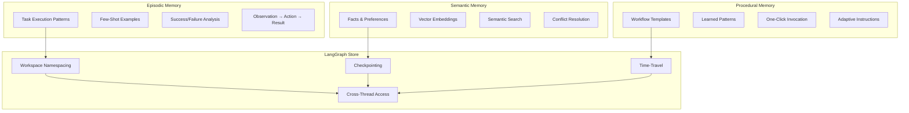

# Shannon Deep Agents Design
## LangChain Deep Agents + Visual Context Engineering Architecture

## Overview

This design document outlines the implementation of Shannon Deep Agents architecture based on your comprehensive 12-task implementation plan. The system implements LangChain's proven Deep Agents patterns including LangGraph Store backend, Context Engineering four pillars (WRITE/SELECT/COMPRESS/ISOLATE), TodoList middleware, three-tier memory system, workspace isolation, visual context builder, and ambient monitoring while building upon Shannon's existing polished architecture.

The design leverages existing components (HybridAIClient, MessageManager, SidePanel, Options) and adds sophisticated agent coordination layers including workspace isolation, visual context controls, memory-as-notebooks, and trust-based autonomy progression that demonstrate production-ready Deep Agents patterns.

## Architecture

### System Architecture Overview

```mermaid
graph TB
    subgraph "User Interface Layer"
        SP[Enhanced SidePanel]
        WS[Workspace Tabs]
        AC[Autonomy Controls]
        CP[Context Pills]
        OP[Enhanced Options]
        AM[@-Mention System]
    end
    
    subgraph "Context Engineering Layer"
        CTX[ContextManager]
        WM[WorkspaceManager]
        CVB[ContextVisualBuilder]
        COMP[ChromeAIService]
        AMB[AmbientMonitor]
    end
    
    subgraph "Deep Agents Layer"
        EX[Enhanced Executor]
        MW[TodoList Middleware]
        MEM[Three-Tier Memory]
        LGS[LangGraph Store]
    end
    
    subgraph "Enhanced Services Layer"
        MM[Enhanced MessageManager]
        HAI[HybridAIClient]
        GM[Enhanced GmailService]
        AN[Enhanced Analytics]
    end
    
    SP --> WM
    WS --> WM
    AC --> WM
    CP --> CVB
    CVB --> CTX
    
    CTX --> MEM
    CTX --> LGS
    MW --> LGS
    
    EX --> MW
    EX --> MM
    MM --> CTX
    
    AMB --> WM
    AMB --> CVB
    
    COMP --> HAI
    GM --> MEM
    AN --> MEM
```

### Context Engineering Four Pillars Architecture

```mermaid
graph TB
    subgraph "WRITE Pillar"
        W1[Episodic Memory Storage]
        W2[Semantic Fact Extraction]
        W3[Procedural Pattern Learning]
        W4[Context Observation Recording]
    end
    
    subgraph "SELECT Pillar"
        S1[Visual Context Builder]
        S2[@-Mention Resolution]
        S3[Smart Suggestions Engine]
        S4[Context Pinning System]
    end
    
    subgraph "COMPRESS Pillar"
        C1[User-Controlled Strategies]
        C2[Chrome Prompt API]
        C3[Before/After Preview]
        C4[Real-time Token Visualization]
    end
    
    subgraph "ISOLATE Pillar"
        I1[Workspace Namespacing]
        I2[Memory Boundaries]
        I3[Cross-Workspace Synthesis]
        I4[Autonomy Level Enforcement]
    end
    
    W1 --> S1
    W2 --> S2
    W3 --> S3
    W4 --> S4
    
    S1 --> C1
    S2 --> C2
    S3 --> C3
    S4 --> C4
    
    C1 --> I1
    C2 --> I2
    C3 --> I3
    C4 --> I4
```

### Deep Agents Memory Architecture



## Components and Interfaces

### 1. LangGraphStore (Task 1)

**Purpose**: LangGraph Store-inspired backend with workspace namespacing

```typescript
interface LangGraphStore {
  // Core Store API (inspired by LangGraph Store)
  put(namespace: MemoryNamespace, key: string, value: any): Promise<void>;
  get(namespace: MemoryNamespace, key: string): Promise<any>;
  search(namespace: MemoryNamespace, query: object): Promise<any[]>;
  delete(namespace: MemoryNamespace, key: string): Promise<void>;
  
  // Workspace isolation
  createNamespace(workspaceId: string): Promise<void>;
  cleanupNamespace(workspaceId: string): Promise<void>;
  
  // Checkpointing (LangGraph pattern)
  createCheckpoint(workspaceId: string, sessionId: string, label: string): Promise<string>;
  restoreCheckpoint(workspaceId: string, sessionId: string, checkpointId: string): Promise<void>;
  listCheckpoints(workspaceId: string, sessionId: string): Promise<Checkpoint[]>;
}

interface MemoryNamespace {
  userId: string;
  workspaceId: string;
  threadId?: string;
}

interface Checkpoint {
  id: string;
  label: string;
  timestamp: number;
  metadata: CheckpointMetadata;
}
```

### 2. ContextManager (Task 2)

**Purpose**: Central orchestrator implementing LangChain's 4 pillars

```typescript
interface ContextManager {
  // WRITE Pillar - Memory-aware writing
  write(workspaceId: string, context: ContextItem, type: 'episodic' | 'semantic' | 'procedural'): Promise<void>;
  
  // SELECT Pillar - Visual context building
  select(workspaceId: string, query: string, tokenLimit: number, options?: SelectOptions): Promise<ContextItem[]>;
  
  // COMPRESS Pillar - User-controlled compression
  compress(items: ContextItem[], strategy: CompressionStrategy, targetTokens: number): Promise<CompressionResult>;
  
  // ISOLATE Pillar - Workspace-level isolation
  isolate(workspaceId: string): Promise<WorkspaceContext>;
  
  // Quality assessment
  assessQuality(items: ContextItem[]): Promise<QualityScore>;
  reorderForAttention(items: ContextItem[]): ContextItem[];
}

interface ContextItem {
  type: 'message' | 'page' | 'gmail' | 'memory' | 'file';
  content: string;
  metadata: {
    source: string;
    timestamp: number;
    tokens: number;
    priority: number; // 1-5, for lost-in-the-middle mitigation
  };
}

interface CompressionResult {
  compressed: ContextItem[];
  originalTokens: number;
  compressedTokens: number;
  compressionRatio: number;
}
```

### 3. MemoryService (Task 3)

**Purpose**: Three-tier memory system with Deep Agents patterns

```typescript
interface MemoryService {
  // Episodic Memory (Session-based)
  saveEpisode(workspaceId: string, sessionId: string, episode: Episode): Promise<void>;
  getRecentEpisodes(workspaceId: string, sessionId: string, limit: number): Promise<Episode[]>;
  
  // Semantic Memory (Long-term facts)
  saveFact(workspaceId: string, key: string, value: any, metadata?: FactMetadata): Promise<void>;
  getFact(workspaceId: string, key: string): Promise<any>;
  searchFacts(workspaceId: string, query: string, limit: number): Promise<SearchResult[]>;
  
  // Procedural Memory (Learned patterns)
  savePattern(workspaceId: string, pattern: WorkflowPattern): Promise<void>;
  getPattern(workspaceId: string, name: string): Promise<WorkflowPattern>;
  listPatterns(workspaceId: string): Promise<PatternSummary[]>;
}

interface Episode {
  query: string;
  actions: string[];
  outcome: 'success' | 'failure';
  reasoning: string;
}

interface WorkflowPattern {
  name: string;
  description: string;
  steps: WorkflowStep[];
  successRate?: number;
}
```

### 4. TodoListMiddleware (Task 3.2)

**Purpose**: Deep Agents planning tool for task decomposition

```typescript
interface TodoListMiddleware {
  // Planning tool: write_todos (Deep Agents pattern)
  writeTodos(workspaceId: string, sessionId: string, todos: string[]): Promise<void>;
  getTodos(workspaceId: string, sessionId: string): Promise<string[]>;
  updateTodos(workspaceId: string, sessionId: string, completedActions: string[]): Promise<void>;
  
  // Task decomposition
  decomposeTasks(workspaceId: string, complexTask: string): Promise<TaskDecomposition>;
  trackProgress(workspaceId: string, sessionId: string): Promise<ProgressReport>;
}

interface TaskDecomposition {
  mainTask: string;
  subtasks: SubTask[];
  dependencies: TaskDependency[];
  estimatedDuration: number;
}

interface SubTask {
  id: string;
  description: string;
  status: 'pending' | 'in_progress' | 'completed' | 'failed';
  dependencies: string[];
}
```

### 5. WorkspaceManager (Task 4)

**Purpose**: Workspace isolation with autonomy controls

```typescript
interface WorkspaceManager {
  // Workspace lifecycle
  createWorkspace(config: WorkspaceConfig): Promise<string>;
  switchWorkspace(workspaceId: string): Promise<void>;
  getActiveWorkspace(): Promise<string>;
  
  // Autonomy management
  setAutonomyLevel(workspaceId: string, level: AutonomyLevel): Promise<void>;
  getAutonomyLevel(workspaceId: string): Promise<AutonomyLevel>;
  updateTrustScore(workspaceId: string, taskSuccess: boolean): Promise<void>;
  
  // Cross-workspace operations
  synthesizeWorkspaces(sourceIds: string[], targetId: string): Promise<SynthesisResult>;
}

interface WorkspaceConfig {
  name: string;
  description: string;
  autonomyLevel: 1 | 2 | 3 | 4 | 5;
  approvalPolicies: {
    gmail: boolean;
    calendar: boolean;
    slack: boolean;
    [tool: string]: boolean;
  };
  color: string;
}

interface AutonomyLevel {
  level: number;
  name: string;
  description: string;
  permissions: string[];
}
```

### 6. ContextVisualBuilder (Task 5)

**Purpose**: Visual context builder with @-mention system

```typescript
interface ContextVisualBuilder {
  // Context pills management
  createContextPill(source: ContextSource): ContextPill;
  reorderContextPills(workspaceId: string, newOrder: string[]): Promise<void>;
  removeContextPill(workspaceId: string, pillId: string): Promise<void>;
  
  // @-mention system
  getAtMentionSuggestions(workspaceId: string, partial: string): Promise<AtMentionSuggestion[]>;
  resolveAtMention(workspaceId: string, mention: string): Promise<ContextSource>;
  
  // Smart suggestions
  generateSmartSuggestions(workspaceId: string, taskDescription: string): Promise<ContextSuggestion[]>;
  suggestContextForTaskType(taskType: string): Promise<ContextTemplate>;
}

interface ContextPill {
  id: string;
  type: 'page' | 'gmail' | 'memory' | 'file' | 'history';
  label: string;
  tokens: number;
  removable: boolean;
  priority: number;
}

interface AtMentionSuggestion {
  mention: string;
  type: string;
  description: string;
  preview?: string;
}
```

### 7. ChromeAIService (Task 7)

**Purpose**: Chrome Prompt API integration with fallback

```typescript
interface ChromeAIService {
  // Core summarization using Prompt API
  summarize(text: string, options?: SummaryOptions): Promise<string>;
  
  // Memory operations
  extractKeyFacts(conversation: string): Promise<KeyFact[]>;
  compressContext(messages: Message[], targetTokens: number): Promise<string>;
  
  // Token management
  countTokens(text: string): Promise<number>;
  
  // Availability checking
  checkNanoAvailability(): Promise<boolean>;
}

interface SummaryOptions {
  maxLength?: number;
  style?: 'brief' | 'detailed' | 'bullet-points';
}

interface KeyFact {
  key: string;
  value: string;
  confidence: number;
}
```

### 8. AmbientMonitor (Task 9)

**Purpose**: Proactive intelligence and context optimization

```typescript
interface AmbientMonitor {
  // Monitoring lifecycle
  start(): Promise<void>;
  stop(): Promise<void>;
  
  // Context monitoring
  detectContextShifts(workspaceId: string): Promise<ContextShift[]>;
  assessContextQuality(workspaceId: string): Promise<QualityAssessment>;
  
  // Proactive suggestions
  suggestWorkspaceSwitch(currentActivity: Activity): Promise<WorkspaceSuggestion>;
  suggestContextOptimization(workspaceId: string): Promise<OptimizationSuggestion>;
  
  // Clipboard monitoring
  checkClipboard(): Promise<ClipboardSuggestion>;
}

interface ContextShift {
  type: 'domain_change' | 'task_switch' | 'quality_degradation';
  confidence: number;
  suggestion: string;
  action: () => void;
}

interface WorkspaceSuggestion {
  suggestedWorkspace: string;
  reason: string;
  confidence: number;
}
```

## Data Models

### Enhanced Storage Structures

```typescript
// Workspace-scoped context
interface WorkspaceContext {
  id: string;
  name: string;
  autonomyLevel: AutonomyLevel;
  contextPills: ContextPill[];
  conversationHistory: Message[];
  memory: {
    episodic: Episode[];
    semantic: SemanticFact[];
    procedural: WorkflowPattern[];
  };
  lastActivity: Date;
  tokenUsage: TokenUsageStats;
}

// Enhanced context with workspace awareness
interface EnhancedContext {
  workspaceId: string;
  namespace: string;
  items: ContextItem[];
  totalTokens: number;
  quality: QualityScore;
  compressionApplied: boolean;
}

// Memory structures
interface SemanticFact {
  key: string;
  value: any;
  category?: string;
  confidence?: number;
  source?: string;
  timestamp: number;
  workspaceId: string;
}

interface Episode {
  id: string;
  workspaceId: string;
  sessionId: string;
  observation: string;
  thoughts: string;
  action: string;
  result: string;
  success: boolean;
  timestamp: number;
}
```

### UI Component Structures

```typescript
// Workspace tabs
interface WorkspaceTab {
  id: string;
  name: string;
  active: boolean;
  tokenUsage: number;
  lastActivity: Date;
  color: string;
}

// Autonomy controls
interface AutonomySliderState {
  currentLevel: AutonomyLevel;
  trustScore: number;
  successRate: number;
  suggestions: string[];
  restrictions: string[];
}

// Context pills
interface ContextPillsState {
  pills: ContextPill[];
  totalTokens: number;
  maxTokens: number;
  suggestions: ContextSuggestion[];
}

// Compression preview
interface CompressionPreview {
  original: {
    messages: Message[];
    totalTokens: number;
  };
  compressed: {
    messages: Message[];
    totalTokens: number;
  };
  compressionRatio: number;
  strategy: CompressionStrategy;
}
```

## Integration with Existing Systems

### 1. Enhanced MessageManager Integration

```typescript
// Enhanced MessageManager with workspace awareness
class EnhancedMessageManager extends MessageManager {
  private contextManager: ContextManager;
  private workspaceManager: WorkspaceManager;
  
  async getWorkspaceContext(workspaceId: string, query: string, tokenLimit: number): Promise<ContextResult> {
    const items = await this.contextManager.select(workspaceId, query, tokenLimit, {
      types: ['message', 'memory', 'gmail'],
      recencyBias: 0.3,
      semanticThreshold: 0.5
    });
    
    return {
      items,
      totalTokens: items.reduce((sum, item) => sum + item.metadata.tokens, 0),
      compressionApplied: false
    };
  }
  
  async compressMessages(workspaceId: string, sessionId: string, strategy: CompressionStrategy): Promise<CompressionResult> {
    const messages = await this.getWorkspaceMessages(workspaceId, sessionId);
    const items = this.messagesToContextItems(messages);
    const targetTokens = Math.floor(items.reduce((sum, item) => sum + item.metadata.tokens, 0) * 0.5);
    
    return await this.contextManager.compress(items, strategy, targetTokens);
  }
}
```

### 2. Enhanced Executor Integration

```typescript
// Enhanced Executor with Deep Agents middleware
class EnhancedExecutor extends Executor {
  private memoryService: MemoryService;
  private todoMiddleware: TodoListMiddleware;
  
  async beforeAgentRun(workspaceId: string, sessionId: string, query: string): Promise<AgentContext> {
    // Load workspace context
    const context = await this.contextManager.select(workspaceId, query, 100000);
    
    // Load relevant memories
    const episodes = await this.memoryService.getRecentEpisodes(workspaceId, sessionId, 10);
    const facts = await this.memoryService.searchFacts(workspaceId, query, 5);
    const patterns = await this.memoryService.listPatterns(workspaceId);
    
    // Load todos
    const todos = await this.todoMiddleware.getTodos(workspaceId, sessionId);
    
    return {
      context,
      memories: [...episodes, ...facts, ...patterns],
      todos
    };
  }
  
  async afterAgentRun(workspaceId: string, sessionId: string, result: AgentResult): Promise<void> {
    // Save episode
    await this.memoryService.saveEpisode(workspaceId, sessionId, {
      query: result.query,
      actions: result.actions,
      outcome: result.success ? 'success' : 'failure',
      reasoning: result.reasoning
    });
    
    // Update todos
    await this.todoMiddleware.updateTodos(workspaceId, sessionId, result.actions);
    
    // Save successful patterns
    if (result.success && result.actions.length > 3) {
      await this.memoryService.savePattern(workspaceId, {
        name: `Pattern_${Date.now()}`,
        description: result.outcome,
        steps: result.actions.map(action => ({ action, parameters: {}, expectedResult: 'success' }))
      });
    }
  }
}
```

## Error Handling

### Context Error Recovery

```typescript
class ContextErrorHandler {
  async handleError(error: ContextError, workspaceId: string): Promise<RecoveryAction> {
    switch (error.type) {
      case 'COMPRESSION_FAILED':
        return await this.recoverFromCompressionFailure(error, workspaceId);
      
      case 'MEMORY_CORRUPTION':
        return await this.recoverFromMemoryCorruption(error, workspaceId);
      
      case 'WORKSPACE_ISOLATION_BREACH':
        return await this.recoverFromIsolationBreach(error, workspaceId);
      
      default:
        return await this.genericRecovery(error, workspaceId);
    }
  }
  
  private async recoverFromCompressionFailure(error: ContextError, workspaceId: string): Promise<RecoveryAction> {
    // Fallback to existing schema simplification
    const fallbackCompression = await this.contextManager.compressWithSchemaOptimization(error.context);
    
    return {
      type: 'RETRY_WITH_FALLBACK',
      data: fallbackCompression,
      message: 'Retrying with fallback compression method'
    };
  }
}
```

## Testing Strategy

### Unit Testing

```typescript
// ContextManager tests
describe('ContextManager', () => {
  test('WRITE pillar stores context with workspace isolation', async () => {
    const contextManager = new ContextManager();
    const workspaceId = 'test-workspace';
    const context = createTestContext();
    
    await contextManager.write(workspaceId, context, 'episodic');
    
    const retrieved = await contextManager.isolate(workspaceId);
    expect(retrieved.messages).toContain(context);
  });
  
  test('SELECT pillar respects workspace boundaries', async () => {
    const contextManager = new ContextManager();
    const workspace1 = 'workspace-1';
    const workspace2 = 'workspace-2';
    
    await contextManager.write(workspace1, createTestContext('workspace1-content'), 'episodic');
    await contextManager.write(workspace2, createTestContext('workspace2-content'), 'episodic');
    
    const workspace1Context = await contextManager.select(workspace1, 'test query', 1000);
    const workspace2Context = await contextManager.select(workspace2, 'test query', 1000);
    
    expect(workspace1Context).not.toEqual(workspace2Context);
  });
});
```

### Integration Testing

```typescript
// End-to-end workspace isolation test
describe('Workspace Isolation', () => {
  test('complete workflow maintains isolation', async () => {
    const workspaceManager = new WorkspaceManager();
    const contextManager = new ContextManager();
    
    // Create two workspaces
    const researchWorkspace = await workspaceManager.createWorkspace({
      name: 'Research',
      autonomyLevel: 3,
      approvalPolicies: { gmail: true }
    });
    
    const debugWorkspace = await workspaceManager.createWorkspace({
      name: 'Debug',
      autonomyLevel: 1,
      approvalPolicies: { gmail: false }
    });
    
    // Add context to each workspace
    await contextManager.write(researchWorkspace, createResearchContext(), 'episodic');
    await contextManager.write(debugWorkspace, createDebugContext(), 'episodic');
    
    // Verify isolation
    const researchContext = await contextManager.isolate(researchWorkspace);
    const debugContext = await contextManager.isolate(debugWorkspace);
    
    expect(researchContext.messages).not.toContainEqual(expect.objectContaining(debugContext.messages[0]));
    expect(debugContext.messages).not.toContainEqual(expect.objectContaining(researchContext.messages[0]));
  });
});
```

This design provides a comprehensive architecture for implementing Shannon Deep Agents with all the sophisticated patterns you outlined while building upon the existing polished Shannon codebase.